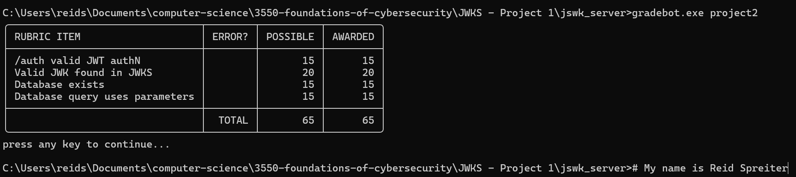
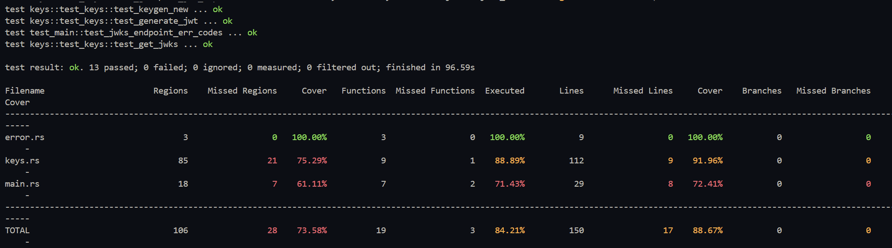

# Simple JWKs Server

### Images

Test client running against server:



Test suite results, including coverage:



### Installation

Clone this repository

### Execution

```
cargo run
```

### Testing

```
cargo llvm-cov --workspace --all-features --tests
```

### Formatting

```
cargo fmt
```
